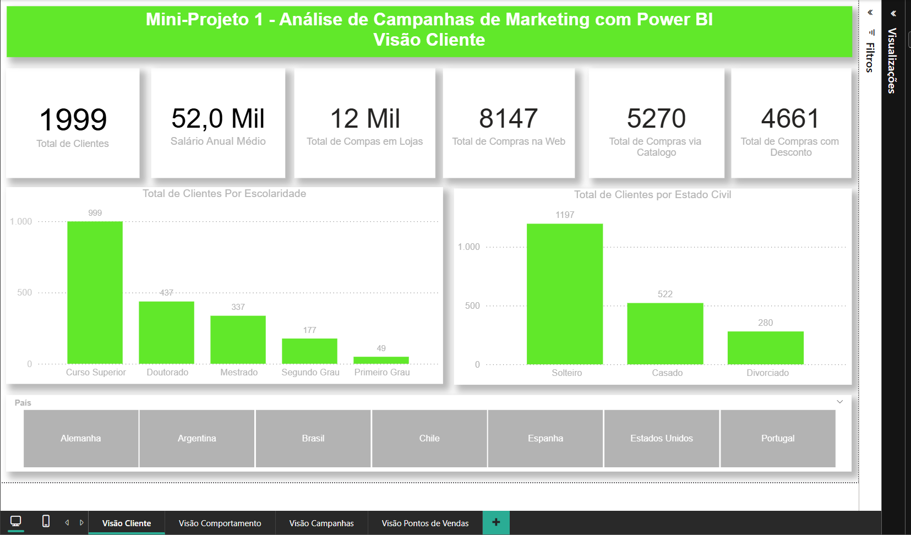

# 📊 Mini-Projeto 1: Análise de Campanhas de Marketing com Microsoft Power BI

Projeto desenvolvido durante o curso **Microsoft Power BI para Business Analytics**, da Data Science Academy (DSA).

---

## 📖 Visão Geral do Projeto

Este projeto consiste na construção de relatórios analíticos desenvolvidos no Microsoft Power BI para análise de dados de campanhas de marketing. O objetivo foi transformar dados brutos em informações estratégicas capazes de apoiar a tomada de decisão por meio de relatórios, indicadores de desempenho (KPIs) e visualizações gráficas.

Durante o desenvolvimento, foram aplicados conceitos iniciais de Business Intelligence (BI), modelagem de dados, Data Visualization e DAX (*Data Analysis Expressions*), permitindo explorar diferentes perspectivas de negócio e compreender o comportamento dos clientes nas campanhas de marketing, além dos padrões de compra de acordo com diferentes países.

O relatório foi estruturado em quatro páginas principais:
* **👥 Visão do Cliente**
* **🛒 Visão do Comportamento de Compra**
* **📈 Visão da Performance das Campanhas de Marketing**
* **🌎 Visão dos Padrões de Compra no Ponto de Venda (País)**

---

## 🎯 Objetivos do Projeto

1. Construir um dashboard profissional utilizando o Microsoft Power BI;
2. Aplicar técnicas de modelagem de dados;
3. Criar medidas utilizando DAX;
4. Desenvolver indicadores estratégicos (KPIs);
5. Explorar diferentes tipos de visualizações;
6. Aplicar boas práticas de design e usabilidade em dashboards;
7. Demonstrar como análises de marketing podem apoiar decisões empresariais.

---

## 🛠️ Tecnologias e Conceitos Utilizados

* **Microsoft Power BI Desktop**
* **Power Query** (Tratamento e ETL de dados)
* **DAX** (Data Analysis Expressions)
* **Modelagem Relacional de Dados**
* **Business Intelligence (BI)**
* **Data Visualization**

---

## 📊 Recursos do Power BI Aplicados

* Cards (KPIs)
* Segmentações de Dados (*Slicers*) e Filtros
* Gráfico de Dispersão (*Scatter Plot*)
* Gráficos de Barras, Linhas e Pizza
* Árvore Hierárquica (*Decomposition Tree*)
* Matrizes e Formatação Condicional de Visuais

---

## 📐 Modelagem e Medidas DAX

Um dos principais focos do projeto foi utilizar medidas em DAX para agregar e resumir dados. 

Foi utilizada a função `SUM` para realizar a soma dos valores numéricos e consolidar os gastos totais dos clientes, permitindo criar indicadores dinâmicos para a análise de desempenho.

---

## 📊 Relatórios Desenvolvidos

### 1. Visão do Cliente
Apresenta uma visão geral do perfil dos consumidores.

* **KPIs Principais:** Total de clientes, salário anual médio, total de compras realizadas (via Web, Catálogo e com Desconto).
* **Análises:** Distribuição dos clientes por escolaridade, estado civil e comparação entre canais de compra.
* **Filtros Interativos:** Segmentação por país (Argentina, Alemanha, Brasil, Chile, Espanha, Estados Unidos e Portugal).

### 2. Visão do Comportamento de Compra
Análise aprofundada sobre os hábitos e perfis de consumo.
* **Gráfico de Dispersão:** Relação entre salário anual e total gasto.
* **Árvore de Decomposição:** Análise do total gasto por estado civil (solteiros, casados, divorciados) e escolaridade (Graduação, Mestrado, Doutorado).
* **Impacto Familiar:** Avaliação de como a presença de filhos ou adolescentes em casa influencia o volume de compras.

### 3. Visão da Performance das Campanhas de Marketing
Avaliação da eficiência das estratégias de marketing.
* **Taxa de Conversão:** **16%** dos clientes realizaram compras após as campanhas, enquanto **84%** não converteram.
* **Análises de Perfil:** Relação entre quantidade de filhos, faixa salarial e o sucesso de conversão das campanhas.

### 4. Visão dos Padrões de Compra no Ponto de Venda (País)
Análise comparativa regional e temporal.
* **Análise por Categoria:** Total gasto em alimentos, brinquedos, eletrônicos, móveis, utilidades e vestuário.
* **Análise Temporal:** Evolução dos gastos ao longo de 6 anos para identificar tendências de crescimento ou redução por país.

---

## 📈 Principais Insights

* **Perfil Educacional:** A maioria dos clientes possui ensino superior.
* **Estado Civil:** Clientes solteiros representam a maior parcela da base de consumidores.
* **Renda vs. Consumo:** Existe uma correlação direta entre a faixa salarial e o volume total gasto.
* **Impacto Familiar:** A presença de filhos em casa altera significativamente o comportamento e a frequência de compra.
* **Oportunidade em Marketing:** A taxa de resposta de 16% às campanhas aponta uma oportunidade para refinar a segmentação e engajar os 84% restantes.
* **Variação Regional:** O comportamento de consumo e a preferência por categorias variam de forma relevante entre os países analisados.

---

## 📚 Aprendizados e Conclusão

Este projeto proporcionou uma experiência prática completa em Business Intelligence — desde a estruturação do modelo de dados no Power Query e criação de medidas DAX até o design de relatórios focados na experiência do usuário e tomada de decisão.

A combinação das análises do perfil do cliente, comportamento de compra, resposta a marketing e padrões internacionais permitiu extrair visões valiosas para o negócio, consolidando competências essenciais para a área de Análise de Dados.

---

## 👩‍💻 Autora

**Dayanne Cabral**  
Projeto desenvolvido como atividade prática do curso *Microsoft Power BI para Business Analytics* da **Data Science Academy (DSA)**.
